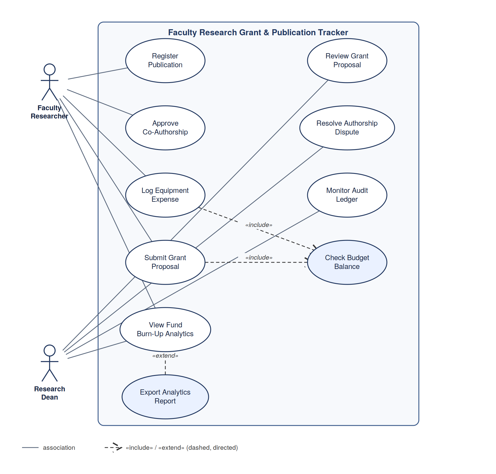

# Faculty Research Grant & Publication Tracker

**Lab 1 — Requirements Engineering & UML Use-Case Modelling**
**Problem Statement #09 | Campus & Academic Operations**

## Problem Context

The research deanery requires an automated portal to track sponsored research grants, faculty publication metrics (indexing, citations), co-author approval workflows, and fund burn-up analytics.

**Actors:** Faculty Researcher, Research Dean

## Repository Structure

```
.
├── README.md
├── requirements/
│   └── requirements-table.md        # FR-001..FR-005, NFR-001..NFR-002
├── diagrams/
│   ├── use-case-diagram.svg         # UML use-case diagram
│   ├── use-case-diagram.png         # PNG export of the same diagram
│   └── build_diagram.py             # Script that generates the SVG
└── docs/
    └── use-case-flow-submit-grant-proposal.md   # 1-page flow spec
```

## Deliverable 1 — Requirements Table
See [`requirements/requirements-table.md`](requirements/requirements-table.md) — 5 Functional Requirements (FR-001–FR-005) and 2 Non-Functional Requirements (NFR-001–NFR-002), each with ID, Type/Priority, Description, Acceptance Criteria, and Rationale.

## Deliverable 2 — UML Use-Case Diagram
See [`diagrams/use-case-diagram.svg`](diagrams/use-case-diagram.svg).



- **Actors:** Faculty Researcher, Research Dean
- **«include»:** *Log Equipment Expense* and *Submit Grant Proposal* both include **Check Budget Balance**
- **«extend»:** *Export Analytics Report* extends **View Fund Burn-Up Analytics**

## Deliverable 3 — Use-Case Flow Specification
See [`docs/use-case-flow-submit-grant-proposal.md`](docs/use-case-flow-submit-grant-proposal.md) for the fully detailed **Submit Grant Proposal** use case (Preconditions, Postconditions, Main Success Scenario, and two Alternate Flows).
